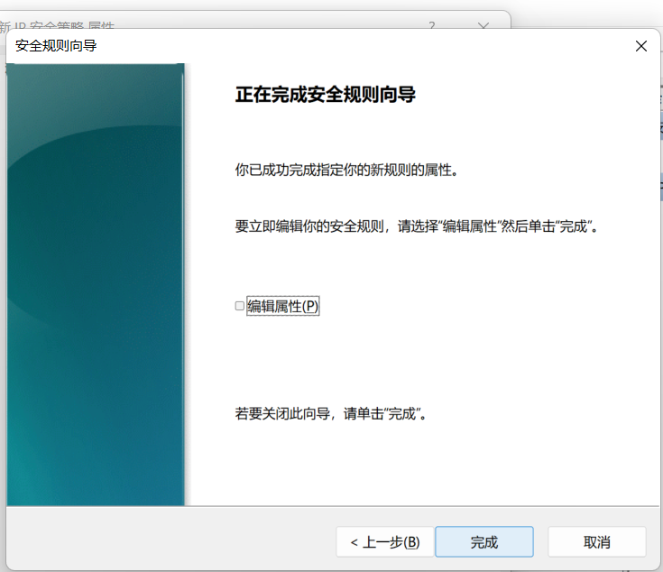
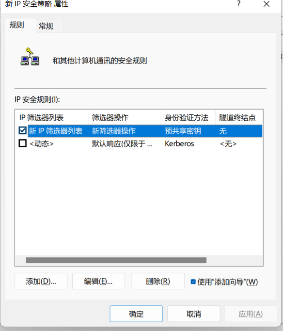

# Ipsec实验

## 实验目的

学会配置IPSec协议。利用网络抓包软件分别对使用安全协议和未使用安全协议两种情况下数据报的不同，从而理解安全协议的作用。

## 实验内容

1. IPSec协议配置与分析

2. 配置 IPSec 协议

3. 对数据进行抓包并分析

   

## 实验过程

本机：

另一台电脑：

进入IP安全策略

添加IP筛选器和筛选器列表

**配置后的结果**

下面分别查看

 IP 筛选列表 

可以设置源、目ip和端口及服务类别 

筛选操作 

设置符合该ip规则的输入输出流该如何处理，一般可以选择协商安全 

身份验证方法 

可以使用的身份验证方法，有证书和预共享密钥方法 隧道设置 

可以设置隧道端点，如果不设置为传输方式 连接类型

**开始通信：**

本机ip:192.168.10.105

另一台ip为:192.168.10.103

检测网络

访问：

采用ESP加密且认证 设置：

抓包：

## 实验小结

最后没能在http包中找出登录的信息，后续还会进行抓包的学习，查缺补漏！

补充一下ssl和ipsec的区别：

IPSec两端的软件需要供应商相同，不利于建立企业外网的应用。需要配置管理通讯的每个结点，且从特定设备接入，提高了配置和运行的成本。

SSL让企业实现多用户在不同地点接入，需要维护中心结点和网关设备，客户端免维护，对客户端设备要求低，降低了配置和运行成本。