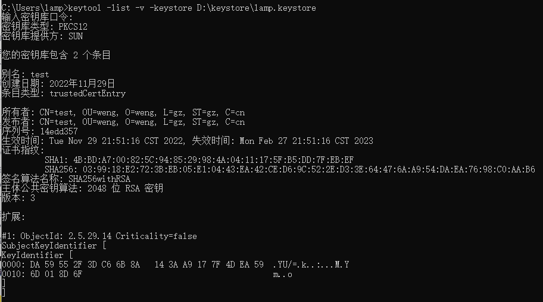

# PKI实验报告

## 实验内容

使用 JDK 自带的证书创建工具进行证书的签发与导入等操作


## 实验目的

了解证书、 证书申请、证书签发等操作过程。


## 实验过程

### 创建密钥库和密钥条目

1.创建一个新的密钥库并生成一个名为"www.lamp.org"的条目。

```
-genkeypair：生成一对非对称密钥并将公钥包装到X.509 v3自签名证书中；

-alias：指定密钥条目的别名，该别名是公开的；

-keyalg：指定加密算法，本例中的采用通用的RSA加密算法；

-keystore：指定密钥库的路径及名称，若密钥库不存在则创建。若不指定则默认在操作系统的用户目录下生成一个".keystore"的文件；

-storetype：指定密钥库的类型，如果不指定，默认是JKS。如果创建默认类型密钥库，命令行会提示转化为pkcs12类型，所以这里在创建时指定；

注意：

1、如果指定的密钥库是第一次创建，则必须在创建时初始化一个条目

2、密钥库的密码至少必须6个字符，可以是纯数字或者字母或者数字和字母的组合等

3、"名字与姓氏"应该是输入域名，而不是我们的个人姓名，其他的可以不填

4、如果创建默认类型(JKS)的密钥库，则可附加"-keypass"参数指定条目的密钥口令，如果没有指定则会在最后一步提示"输入该条目的密钥口令，如果与密钥库口令相同按回车"，一般设为与密钥库口令相同。如果创建PKCS12类型的密钥库，则会忽略条目的密钥口令相关参数，因为PKCS12不支持设置密钥库条目密码，默认它与密钥库密码一致。

执行完上述命令后，在操作系统的指定目录下生成了一个"bo.keystore"的文件。
```


2.查看名为lamp.keystore的密钥库信息


3.将密钥库lamp.keystore中别名为www.lamp.org条目的相关信息以及公钥导出到一个数字证书文件lamp.crt中


运行结果：在操作系统的指定目录下生成了一个"lamp.crt"的文件，注意该证书文件不包含私钥。


4.将信任证书test.crt以别名"test"导入到密钥库lamp.keystore中


5.导入test.crt证书后，查看密钥库lamp.keystore信息，新增一个"test"条目：


```
注：test.crt是由另一个密钥库test.keystore生成的证书，将其导入到密钥库lamp.keystore时指定的条目别名不能与密钥库中已存在的条目别名重复（导入签发证书除外），一般与导出该证书的密钥库条目别名相同，此时的导入条目会以信任证书的形式保存，条目类型为 trustedCertEntry
```


6.打印密钥库lamp.keystore中别名为www.lamp.org条目导出的证书lamp.crt


7.删除密钥库lamp.keystore中别名为test的证书条目


### 证书签发与导入

这个过程涉及到3个命令：

-certreq、-gencert、-importcert

1）机构A使用certreq命令生成一个证书签名请求文件CSR（certificate sign request）并将其发送给机构B；

2）机构B接收到这个请求后，使用gencert命令签发证书，会生成一个证书或者证书链；

3）机构A接收到响应，使用importcert命令将签发证书导入到keystore中；

示例：将密钥库test.keystore签名的证书导入到密钥库bo.keystore中


1.首先创建test.keystore密钥库


2.生成证书签名请求文件CSR


```
将条目别名为 www.lamp.org 的公钥和一些个人信息从密钥库 lamp.keystore 文件中导出，作为证书请求文件。
```


3.签发证书


```
使用密钥库test.keystore中别名为 test 的条目私钥为 cert.csr 签发证书，并保存到 test_to_bo.crt 文件中。
```


4.导出test.keystore的信任证书：

 


5.将信任证书test.crt以其别名"test"导入到密钥库lamp.keystore：

 


6.将签发证书test_to_bo.crt以别名"www.lamp.org"导入到密钥库lamp.keystore

 


密钥库lamp.keystore中别名为www.lamp.org条目的自签名证书已被更新为由密钥库test.keystore签名的签发证书：

 

 


## 实验小结

对比最开始生成的密钥库lamp.keystore的证书信息可发现，别名为"www.lamp.org"条目的证书链已由单个lamp.keystore自签名的证书变为2个证书，分别是test.keystore签名的lamp.keystore证书、test.keystore的自签名证书