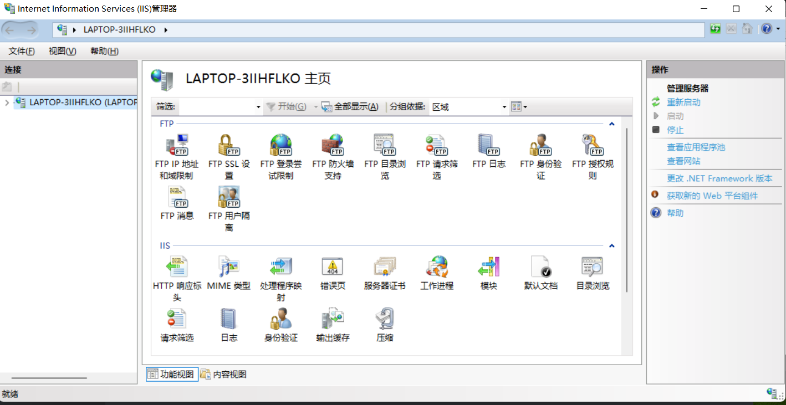
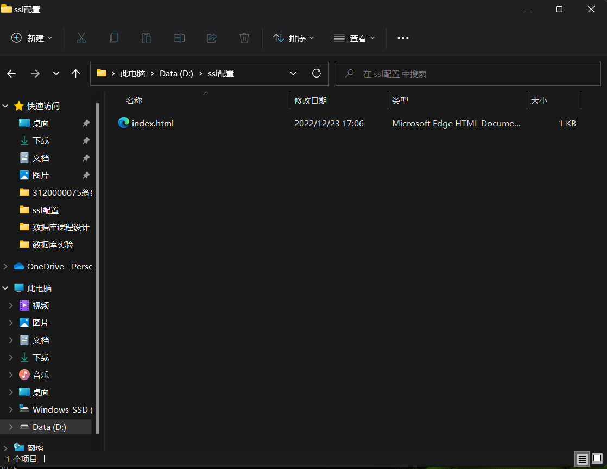
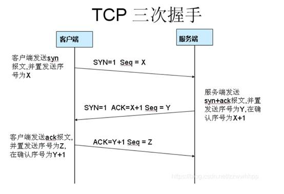

# SSL实验

## 实验目的

学会配置SSL/TLS。利用网络抓包软件分别对使用安全协议和未使用安全协议两种情况下数据报的不同，从而理解安全协议的作用。

## 实验内容

1. 配置SSL/TLS协议

2. 对数据进行抓包并分析

   

## 实验过程

对 https://163.com 进行抓包

获取对应的ip地址

 

对应ssl进行加密，查看抓包数据

 

这使得信息变得不那么容易获取

SSL配置

本机：

另一台电脑：

将Internet Information Services中原本没有选中的选项勾选上

添加网站

 

抓包

**可以发现在没有使用ssl的情况下网络间的数据是赤裸的**

为网站配置ssl证书

重新添加网址

在ssl配置目录下创建web.config配置文档

抓包

可以看到网站已经使用了https协议，因为两边都需要ssl，所以在Wireshark里抓包只会显示TCP握手协议的。所以SSL证书还是不可或缺的的

## 实验小结

在没有使用ssl协议之前，信息是裸露的，使用ssl协议之后，信息得到保护。

找不到web.config文件 只好自己配置一个！

补充：

对163.com进行抓包处理

 

为了更好的分析SSL过程，可以在过滤器加上SSL这个条件，然后就能清晰的看到这个握手过程

SSL/TLS握手过程可以分成两种类型：

1）SSL/TLS 双向认证，就是双方都会互相认证，也就是两者之间将会交换证书。
2）SSL/TLS 单向认证，客户端会认证服务器端身份，而服务器端不会去对客户端身份进行验证。

我们知道，握手过程实际上就是通信双方协商交换一个用于对称加密的密钥的过程，而且握手过程是明文的。
这个过程实际上产生三个随机数:client random, server random, pre-master secret.

前两个随机数都是明文传送的，只有pre-master secret是加密的（RSA或者DH)。
一般生成证书的时候，签名算法可以选择RSA或者DSA算法。
如果server使用RSA证书，RSA即可以用作签名也可以用作不对称加密，pre-master secret就是用server的RSA证书中包含的公钥加密的。
如果server使用DSA证书，DSA只能用作签名，所以还需要使用DH算法来交换密钥。

Tcp建立连接的三次握手的建立过程：

过程：(这里用百度网站进行验证)

1.启动wireshark进行抓包，打开浏览器访问[www.baidu.com](http://www.baidu.com)

2.控制台通过ping [www.baidu.com获取对应访问的ip](http://www.baidu.com获取对应访问的ip)地址 在wireshark中进行过滤

得到结果：

 

1.第一次握手的数据包：客户端发送一个TCP，标志位为SYN，序列号为0， 代表客户端请求建立连接

数据包的关键属性如下：

SYN ：标志位，表示请求建立连接

Seq = 0 ：初始建立连接值为0，数据包的相对序列号从0开始，表示当前还没有发送数据

Ack =0：初始建立连接值为0，已经收到包的数量，表示当前没有接收到数据

 

2.第二次握手的数据包：服务器发回确认包, 标志位为 SYN,ACK. 将确认序号(Acknowledgement Number)设置为客户的I S N加1，即0+1=1,

数据包的关键属性如下：

 

Seq = 0 ：初始建立值为0，表示当前还没有发送数据

 

Ack = 1：表示当前端成功接收的数据位数，虽然客户端没有发送任何有效数据，确认号还是被加1，因为包含SYN或FIN标志位。（并不会对有效数据的计数产生影响，因为含有SYN或FIN标志位的包并不携带有效数据）

 

3.第三次握手的数据包：客户端再次发送确认包(ACK) SYN标志位为0,ACK标志位为1.并且把服务器发来ACK的序号字段+1,放在确定字段中发送给对方.并且在数据段放写ISN的+1

 

数据包的关键属性如下：

ACK ：标志位，表示已经收到记录

Seq = 1 ：表示当前已经发送1个数据

Ack = 1 : 表示当前端成功接收的数据位数，虽然服务端没有发送任何有效数据，确认号还是被加1，因为包含SYN或FIN标志位（并不会对有效数据的计数产生影响，因为含有SYN或FIN标志位的包并不携带有效数据)。

 

就这样通过了TCP三次握手，建立了连接。开始进行数据交互